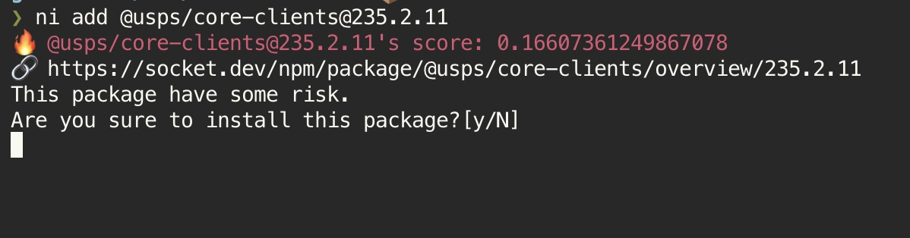

# Alternative `ni` written in zsh

`ni` - use the right package manager

You can run npm/yarn/pnpm/bun with same command!

- Original: <https://github.com/antfu/ni>

## Installation

### Using Zinit

```shell
zinit load azu/ni.zsh
```

### Using Antigen

```shell
antigen bundle azu/ni.zsh@main
```

### Using sheldon

```toml
[plugins.ni]
github = "azu/ni.zsh"
```

### Manually

```shell
curl https://raw.githubusercontent.com/azu/ni.zsh/main/ni.zsh > ni.zsh
source ni.zsh
```

### :warning: Troubleshooting: `command not found: compdef`

`ni.zsh` requires `compdef` command.
If you got `command not found: compdef` error, you need to enable `compinit` in your `.zshrc`.

```shell
# .zshrc
# load compdef
autoload -Uz compinit && compinit
# load ni.zsh
source /path/to/ni.zsh
```

## Supported Package Manager

- [npm](https://docs.npmjs.com/cli/)
- [yarn](https://classic.yarnpkg.com/) (yarn v1)
- [yarn-berry](https://yarnpkg.com/) (yarn v2+)
- [pnpm](https://pnpm.js.org/)
- [bun](https://bun.sh/)
- [deno](https://deno.com/) (deno v2.3+)

## Requirements

- zsh
  - require to enable `autoload -Uz compinit && compinit`
- [jq](https://stedolan.github.io/jq/)
- [npm-check](https://github.com/dylang/npm-check) if you want to use `npm` + `ni upgrade-interactive`

## Usage

```sh
ni                      -- install current package.json
ni add <pkg>            -- add package
ni remove <pkg>         -- remove package
ni run <script>         -- run scripts
ni test                 -- run test script
ni upgrade [<pkg>]      -- upgrade packages
ni upgrade-interactive  -- upgrade package interactively
ni exec <command>       -- execute command
ni dlx <pkg>            -- download package and execute command
```

## Command Table

| ni                       | npm               | yarn                       | yarn-berry                 | pnpm             | bun            | deno |
|--------------------------|-------------------|----------------------------|----------------------------|------------------|----------------| ---- |
| `ni`                     | `npm install`     | `yarn install`             | `yarn install`             | `pnpm install`   | `bun install`  | `deno install` |
| `ni add <pkg>`           | `npm install`     | `yarn add`                 | `yarn add`                 | `pnpm add`       | `bun add`      | `deno add --npm` |
| `ni remove <pkg>`        | `npm uninstall`   | `yarn remove`              | `yarn remove`              | `pnpm remove`    | `bun remove`   | `deno uninstall` |
| `ni run <script>`        | `npm run`         | `yarn run`                 | `yarn run`                 | `pnpm run`       | `bun run`      | `deno run` |
| `ni test`                | `npm run test`    | `yarn run test`            | `yarn run test`            | `pnpm run test`  | `bun run test` | `deno run test` |
| `ni upgrade`             | `npm upgrade`     | `yarn upgrade`             | `yarn up`                  | `pnpm update`    | `bun update`              | `deno outdated --update` |
| `ni upgrade-interactive` | `npm-check`**^1** | `yarn up --interactive "*"` | `yarn upgrade-interactive` | `pnpm update -i` | ○              | `deno outdated --update --interactive` |
| `ni exec <command>`      | `npm exec --no`   | `yarn <command>`           | `yarn exec`                | `pnpm exec`      | `bunx`         | ○             |
| `ni dlx <pkg>`       | `npx`             | `npx`                      | `yarn dlx`                 | `pnpm dlx`       | `bunx`         | ○             |

- **^1**: require [npm-check](https://github.com/dylang/npm-check) globally.

**Notes**

- Installing devDependencies: `ni add --dev <pkg>`
- Additional arguments for `ni run`: `ni run dev --port 8080`
- Update specific package: `ni upgrade <pkg>`

## Auto Complete

```sh
ni <TAB>
```

## Experimental

### Supply chain risk detections

You can integrate https://socket.dev/ to detect supply chain attacks.



https://github.com/azu/ni.zsh/assets/19714/d6251e40-043f-4450-b9f2-716a712ae71b


If `NI_SOCKETDEV_TOKEN` is set, `ni add` will check the package is safe or not before installing.

```
export NI_SOCKETDEV_TOKEN="<socket-token>"
```

**How to get socket.dev token?**

1. Go to https://socket.dev/
2. Sign up
3. Create a project
4. Visit `https://socket.dev/dashboard/org/gh/{user}/settings/api-tokens`
5. Copy token


## License

MIT © azu
